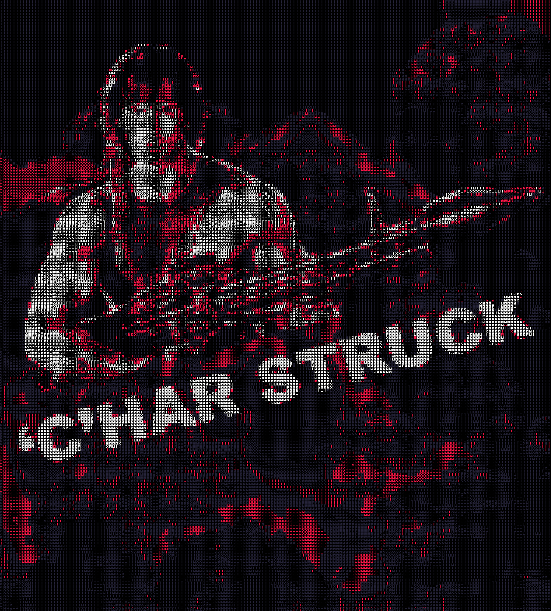

## CharStruck game

Kanban https://github.com/Yogsther/CharStruck/projects/1

Projects parts

```
- game, Main game, written in javscript

- cover-art, Blend files and images relating to the creation of the cover art of the game.

- charify-image, Software written in javascript for Node used when creating the 2D cover art image.

- cpp-prototype, Some SDL2 testing that was done early in the project when evaluating what technology to use for the game.
```


