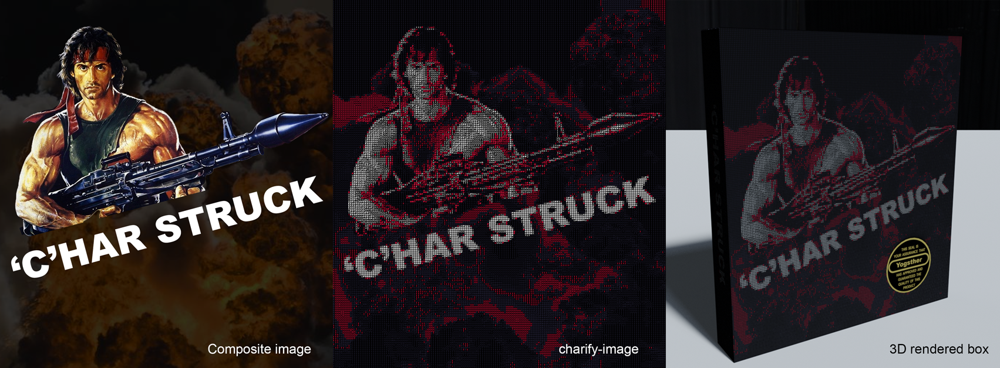
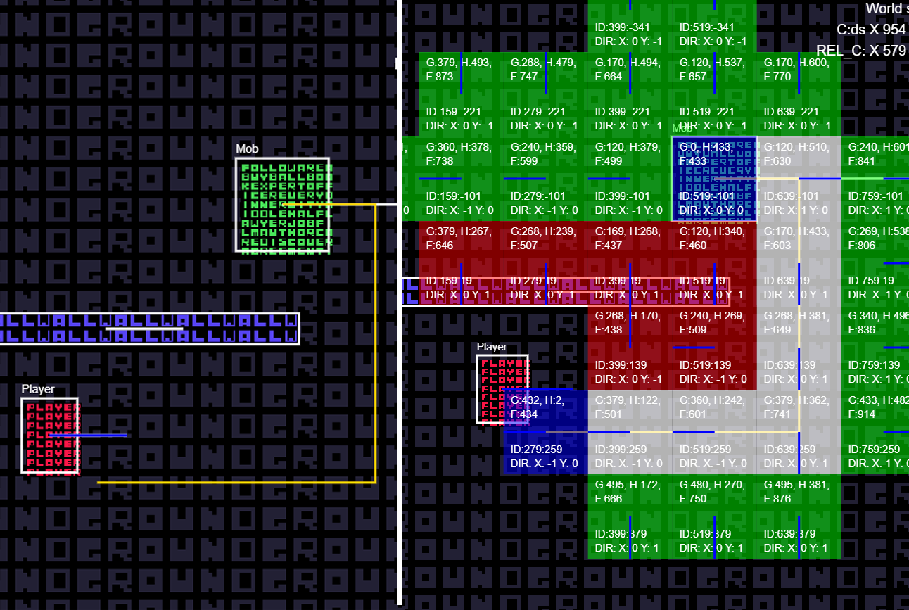
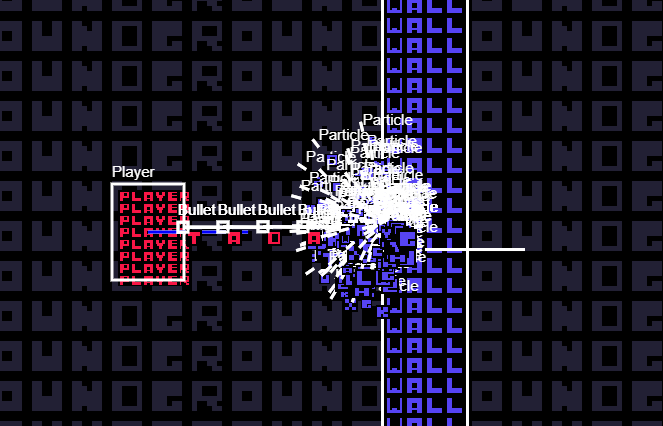

## CharStruck game

Kanban https://github.com/Yogsther/CharStruck/projects/1

Projects parts

```
- game, Main game, written in javscript

- cover-art, Blend files and images relating to the creation of the cover art of the game.

- charify-image, Software written in javascript for Node used when creating the 2D cover art image.

- cpp-prototype, Some SDL2 testing that was done early in the project when evaluating what technology to use for the game.
```

## Cover art made with charify-image

charify-image uses the fonts from the game in different colors and creates a pixelated image


## AI Pathfinding

For AI Pathfinding, I use A\*. If the player is not visible for the Mob, it will try to navigate to where it last saw the player.



## Debug mode

By pressing ESC you can open the DEBUG menu. Here you can preview hitboxes, load levels, edit the map, save the map, disable collisions and visualize the pathfinding.


